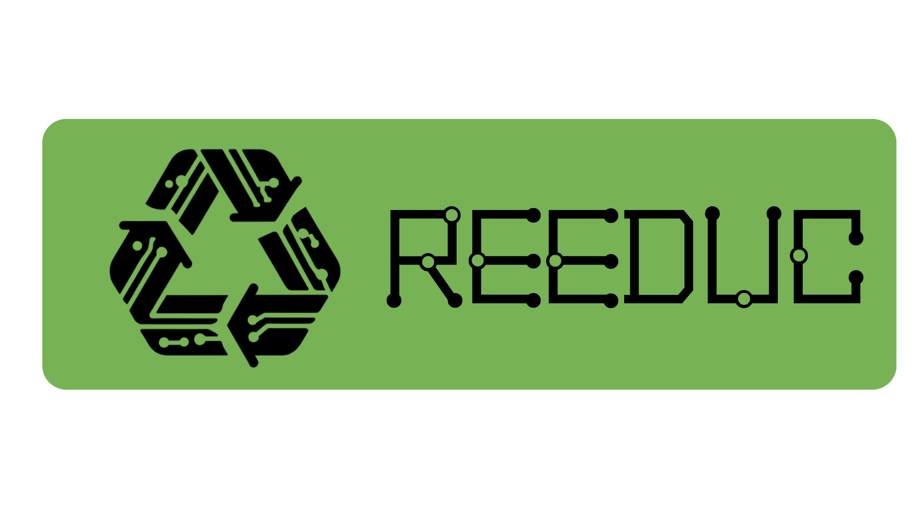

<p align="center">
    
</p>

<p align="center">
<b></b>
</p>
<div>
  <h2 id="Introdução">Introdução a API ☕</h2>
  <p>A API tem como objetivo concentrar todas as regras de negócio, as autenticações dos usuários, criptografia de senhas e dados sensíveis e de se comunicar com o banco de dados. Contruida utilizando python, flask e poetry, visa trabalhar da forma mais simples para solução dos problemas.</p>

  
  
  

</div>
<div>
  <h2 id="Estrutura">Estrutura 🛠️</h2>
  <p>Dividida em uma estrutura de pastas para concentrar as responsabilidades de forma organizada segue um padrão modular com as seguintes funções:
  </p>
  <div>
    <h3>./app</h3>
    <p>- Contem a lógica de inicialização da aplicação. Responsável pela contrução do swagger de por adiministrar as coneções com o banco de dados.</p>
    <h3>./database</h3>
    <p>- Responsável pelas configurações e conexões com o banco de dados. Utilizando SQLAlchemy para criar e gerenciar as sessões.</p>
    <h3>./resources</h3>
    <p>- Armazena os recursos da API como seus controladores e rotas. Utiliza pydantic spec para validar as requisições e respostas de acordo com os modelos gerados em ./schemas</p>
    <h3>./schemas</h3>
    <p>- Usado para definir esquemas de dados, para validação e serialização de dados. Utilizando pydantic permite gerar modelos para as requisições e repostas da API</p>
    <h3>./tests</h3>
    <p>- Contém testes unitários e de integração para a aplicação. Utiliza pytest para gerar fixture, marks e estruturar a pipeline de forma segura.</p>
    <h3>./main.py</h3>
    <p>- Ponto de entrada principal da aplicação.</p>     
    <h3>./models.py</h3>
    <p>- Define modelos de dados para ORM com SQLAlchemy.</p>
    <h3>./pyproject.toml</h3>
    <p>- Arquivos de configuração e dependências do projeto gerenciados pelo Poetry.</p>    
  </div>
</div>
<div>
  <h2 id="Rodando">Rodando a API 🏃</h2>
  <p>Para executar este projeto é necessário seguir as etapas listadas abaixo:</p>
  <h3>Pré requisitos</h3>
</div>

- Python 🐍
```bash
sudo apt install python3
sudo apt install python3-pip
```
- Poetry 📎
```bash
pip install poetry
```
- MySQL 💽
```bash
sudo apt install mysql-server
```
- Iniciar o banco de dados
```bash
service mysql start
sudo mysql -u root -p
CREATE DATABASE IF NOT EXISTS base; # Apenas na primeira execução.
```
- Iniciar o ambiente com Poetry
```bash
poetry shell
poetry install
```
- Criar .env em ./api
```bash
USERMYSQL=root
PASSWORD=your_password
HOST=localhost
PORT=3306
DATABASE=base
```

<h2 id="Contribuição">Contribuição 🚀</h2>

Para contribuir com o projeto pode seguir as seguintes etapas:

```bash
git clone https://github.com/Bruno-Gomes-QA/Reeduc.git
```

```bash
git checkout -b feat/feature-name
```
Importante seguir o padrão para commits:

| Tipo | Descrição |
|---|---|
| feat | Nova funcionalidade |
| fix | Correção de bug |
| docs | Mudanças na documentação |
| style | Formatação, pontos e vírgulas ausentes, etc. |
| refactor | Refatoração do código de produção, por exemplo, renomeação de uma variável |
| test | Adicionando testes ausentes, refatorando testes |

[Como criar um Pull Request](https://docs.github.com/pt/pull-requests/collaborating-with-pull-requests/proposing-changes-to-your-work-with-pull-requests/creating-a-pull-request) |
[Commit pattern](https://gist.github.com/joshbuchea/6f47e86d2510bce28f8e7f42ae84c716)

Para mais detalhes das etapas desenvolvidas até aqui, e quais partes estão pendentes, pode consultar a [documentação](https://dawn-trollius-58a.notion.site/Reeduc-e0454530e7a141349e97869b135cd3d8) completa.
<h2 id="license">License 📃 </h2>

Este projeto utiliza licença [MIT](./LICENSE) 


